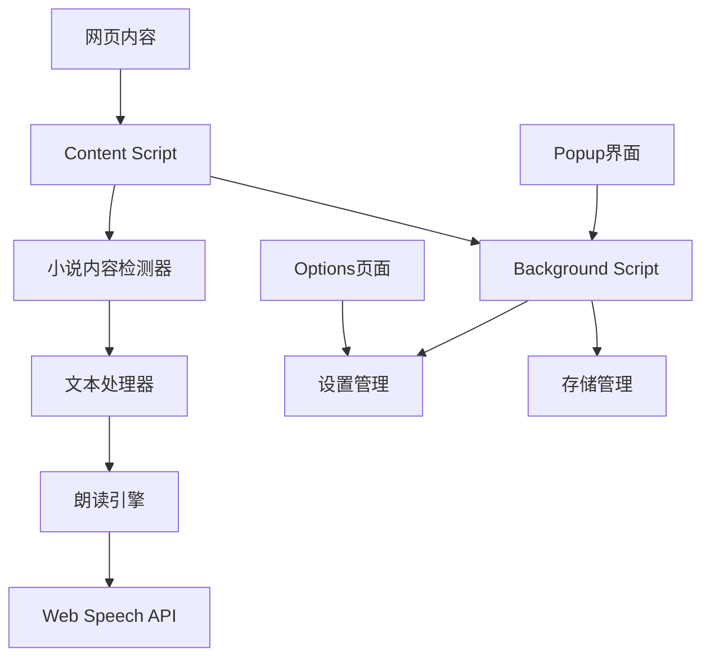
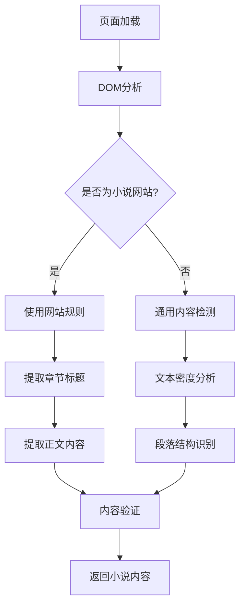
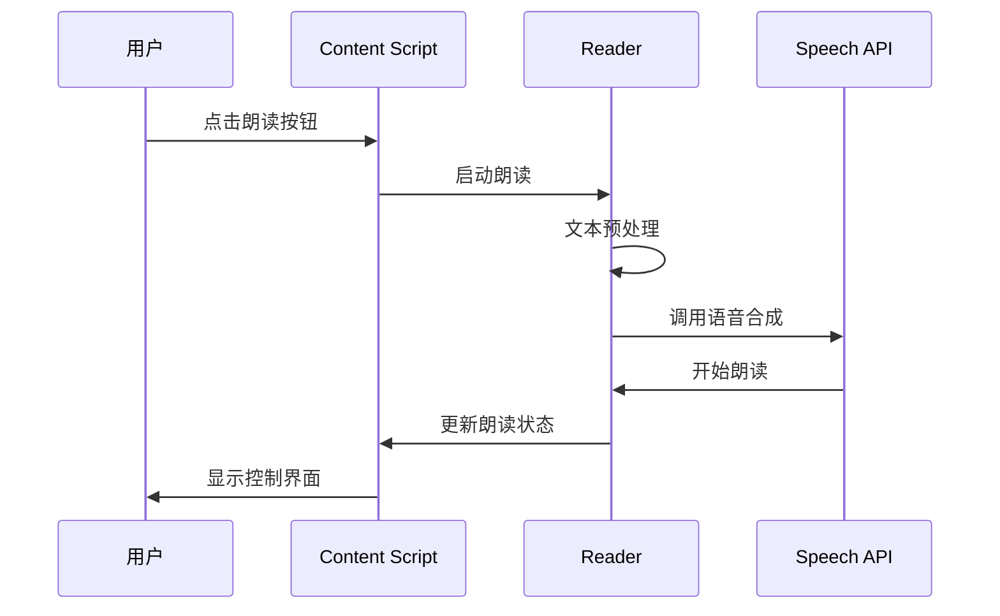
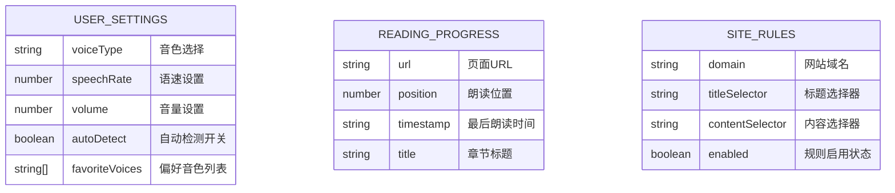
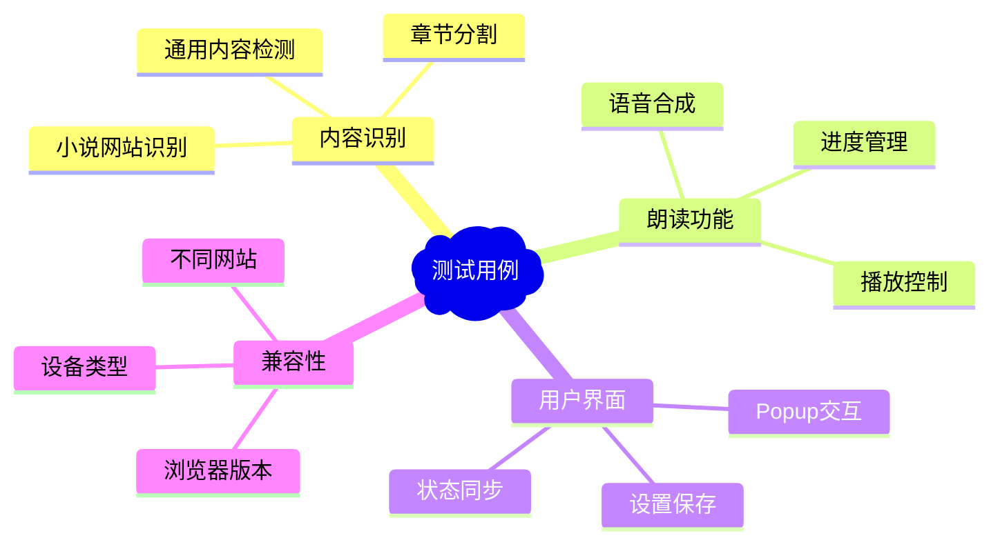
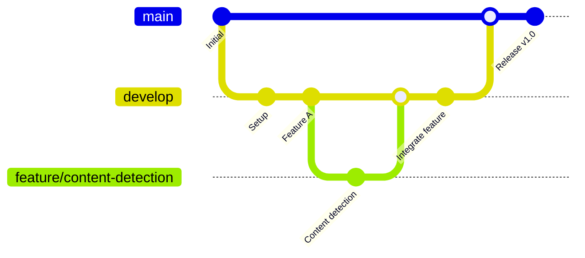

# 浏览器小说阅读插件设计文档

## 1. 概述

这是一个浏览器扩展插件，旨在帮助用户读取网页上的小说内容。插件将能够智能识别小说文本，提供朗读功能，并优化阅读体验。

### 核心功能
- 自动识别网页中的小说内容
- 文本朗读功能
- 阅读进度管理
- 个性化设置（语速、音色等）

### 目标平台
- Chrome浏览器扩展
- 未来可扩展至Firefox、Edge

## 2. 技术栈与依赖

### 核心技术
- **Manifest V3**: Chrome扩展新版本标准
- **JavaScript/TypeScript**: 主要开发语言
- **HTML/CSS**: 用户界面
- **Web Speech API**: 文本转语音功能

### 构建工具
- **Webpack**: 模块打包
- **TypeScript**: 类型安全
- **ESLint + Prettier**: 代码质量保证

### 主要API
- Chrome Extension APIs
- Web Speech API (speechSynthesis)
- DOM操作API

## 3. 项目结构

```
ai-reading/
├── manifest.json                 # 扩展清单文件
├── package.json                  # 项目依赖管理
├── webpack.config.js            # 打包配置
├── tsconfig.json                # TypeScript配置
├── src/
│   ├── background/              # 后台脚本
│   │   └── background.ts
│   ├── content/                 # 内容脚本
│   │   ├── content.ts
│   │   ├── novel-detector.ts    # 小说内容识别
│   │   └── reader.ts           # 朗读功能
│   ├── popup/                   # 弹出窗口
│   │   ├── popup.html
│   │   ├── popup.ts
│   │   └── popup.css
│   ├── options/                 # 设置页面
│   │   ├── options.html
│   │   ├── options.ts
│   │   └── options.css
│   └── utils/                   # 工具函数
│       ├── storage.ts
│       └── text-processor.ts
├── assets/                      # 静态资源
│   ├── icons/
│   │   ├── icon16.png
│   │   ├── icon48.png
│   │   └── icon128.png
│   └── images/
└── dist/                        # 构建输出目录
```

## 4. 核心架构设计

### 插件架构图



### 组件职责

#### Background Script
- 管理插件生命周期
- 处理跨页面通信
- 存储用户设置和阅读进度
- 监听浏览器事件

#### Content Script
- 注入到网页中执行
- 检测和提取小说内容
- 控制朗读功能
- 处理用户交互

#### Popup界面
- 快速控制面板
- 播放/暂停控制
- 基本设置调整
- 当前状态显示

#### Options页面
- 详细设置配置
- 语音参数调整
- 快捷键设置
- 数据管理

## 5. 核心功能模块

### 5.1 小说内容识别模块

#### 识别策略


#### 检测规则
- **网站特定规则**: 预定义主流小说网站的DOM选择器
- **通用检测**: 基于文本密度、段落结构的智能识别
- **内容验证**: 过滤广告、导航等非正文内容

### 5.2 文本朗读模块

#### 朗读流程


#### 功能特性
- **多语音支持**: 支持不同音色和语言
- **语速控制**: 可调节朗读速度
- **断点续读**: 记住朗读位置
- **高亮跟随**: 朗读时高亮当前文本

### 5.3 用户界面模块

#### Popup界面设计
- 简洁的播放控制按钮
- 音量和语速快速调节
- 当前朗读进度显示
- 快速设置入口

#### 网页内嵌控件
- 浮动的播放控制器
- 非侵入式设计
- 可拖拽定位
- 自动隐藏机制

## 6. 数据存储设计

### 存储策略


### 存储类型
- **chrome.storage.sync**: 用户设置同步
- **chrome.storage.local**: 阅读进度本地存储
- **IndexedDB**: 大量数据存储（未来功能）

## 7. 安全与权限设计

### 权限需求
```json
{
  "permissions": [
    "activeTab",
    "storage",
    "scripting"
  ],
  "host_permissions": [
    "<all_urls>"
  ]
}
```

### 安全考虑
- **最小权限原则**: 只请求必要权限
- **内容隔离**: Content Script与页面脚本隔离
- **数据验证**: 所有输入数据进行验证
- **CSP策略**: 严格的内容安全策略

## 8. 测试策略

### 测试层级
- **单元测试**: 核心功能模块测试
- **集成测试**: 组件间交互测试
- **端到端测试**: 完整用户流程测试
- **兼容性测试**: 不同网站和浏览器测试

### 测试工具
- **Jest**: 单元测试框架
- **Puppeteer**: 端到端测试
- **Chrome Extension Test**: 扩展专用测试

### 测试用例


## 9. 初始化实施方案

### 阶段一：基础架构 (Week 1-2)
1. **项目初始化**
   - 创建基本目录结构
   - 配置构建工具
   - 设置开发环境

2. **核心框架搭建**
   - manifest.json配置
   - Background Script基础
   - Content Script注入机制

### 阶段二：核心功能 (Week 3-4)
1. **内容识别功能**
   - 实现通用文本检测算法
   - 添加主流小说网站规则
   - 内容提取和清理

2. **朗读功能开发**
   - Web Speech API集成
   - 基础播放控制
   - 文本预处理

### 阶段三：用户界面 (Week 5-6)
1. **Popup界面开发**
   - 控制面板设计
   - 设置界面开发
   - 状态显示和反馈

2. **网页控件开发**
   - 浮动控制器
   - 进度指示器
   - 交互优化

### 阶段四：优化完善 (Week 7-8)
1. **性能优化**
   - 代码分割和懒加载
   - 内存使用优化
   - 响应速度提升

2. **测试与发布**
   - 全面测试
   - 文档完善
   - 发布准备

## 10. GitHub仓库设计

### 仓库信息
- **仓库地址**: https://github.com/qbh086/ai-reading
- **仓库类型**: 公开仓库
- **主分支**: main
- **许可证**: MIT License

### 仓库文档结构
```
ai-reading/
├── README.md                    # 项目主文档
├── CONTRIBUTING.md              # 贡献指南
├── LICENSE                      # 开源许可证
├── CHANGELOG.md                 # 版本更新日志
├── .github/
│   ├── workflows/               # GitHub Actions
│   │   ├── ci.yml              # 持续集成
│   │   └── release.yml         # 自动发布
│   ├── ISSUE_TEMPLATE/          # Issue模板
│   │   ├── bug_report.md
│   │   └── feature_request.md
│   └── pull_request_template.md # PR模板
├── docs/                        # 详细文档
│   ├── installation.md         # 安装指南
│   ├── user-guide.md           # 用户手册
│   ├── developer-guide.md      # 开发者指南
│   └── api-reference.md        # API文档
└── screenshots/                 # 项目截图
    ├── popup-interface.png
    ├── reading-mode.png
    └── settings-page.png
```

### README.md设计
```markdown
# AI Reading - 智能小说阅读浏览器插件

<div align="center">
  
  
  <p>一个智能的浏览器扩展，帮助您轻松朗读网页上的小说内容</p>
  
  <p>
    <a href="https://chrome.google.com/webstore"></a>
    <a href="https://github.com/qbh086/ai-reading/releases"></a>
    <a href="https://github.com/qbh086/ai-reading/blob/main/LICENSE"></a>
  </p>
</div>

## ✨ 功能特性

- 🔍 **智能识别**: 自动识别网页中的小说内容
- 🗣️ **语音朗读**: 支持多种音色和语速调节
- 📖 **断点续读**: 记住您的阅读进度
- 🎨 **个性化**: 丰富的设置选项，打造专属阅读体验
- 🌐 **广泛兼容**: 支持主流小说网站和通用网页

## 🚀 快速开始

### 安装方式

#### 从Chrome网上应用店安装（推荐）
1. 访问 [Chrome网上应用店](https://chrome.google.com/webstore)
2. 搜索 "AI Reading"
3. 点击 "添加至Chrome"

#### 开发者模式安装
1. 下载最新的 [发布版本](https://github.com/qbh086/ai-reading/releases)
2. 解压文件到本地目录
3. 打开Chrome扩展管理页面 (`chrome://extensions/`)
4. 开启 "开发者模式"
5. 点击 "加载已解压的扩展程序"
6. 选择解压后的文件夹

### 使用方法

1. **访问小说网页**: 打开任意包含小说内容的网页
2. **点击插件图标**: 在浏览器工具栏点击AI Reading图标
3. **开始朗读**: 点击播放按钮开始朗读
4. **调整设置**: 根据需要调整语速、音色等参数

## 📸 界面预览

<div align="center">
  
  
</div>

## 🛠️ 开发

### 环境要求
- Node.js (v16+)
- npm或yarn
- Chrome浏览器

### 本地开发
```bash
# 克隆仓库
git clone https://github.com/qbh086/ai-reading.git
cd ai-reading

# 安装依赖
npm install

# 开发模式
npm run dev

# 构建生产版本
npm run build
```

### 项目结构
```
src/
├── background/     # 后台脚本
├── content/        # 内容脚本
├── popup/          # 弹出界面
├── options/        # 设置页面
└── utils/          # 工具函数
```

## 🤝 贡献

我们欢迎所有形式的贡献！请查看 [贡献指南](CONTRIBUTING.md) 了解详细信息。

### 贡献方式
- 🐛 报告Bug
- 💡 提出新功能建议
- 📝 改进文档
- 🔧 提交代码

## 📄 许可证

本项目采用 [MIT License](LICENSE) 开源许可证。

## 🙏 致谢

感谢所有为这个项目做出贡献的开发者和用户！

---

<div align="center">
  <p>如果这个项目对您有帮助，请给个 ⭐️ 支持一下！</p>
</div>
```

### GitHub Actions CI/CD配置

#### .github/workflows/ci.yml
```yaml
name: CI

on:
  push:
    branches: [ main, develop ]
  pull_request:
    branches: [ main ]

jobs:
  test:
    runs-on: ubuntu-latest
    
    strategy:
      matrix:
        node-version: [16.x, 18.x]
    
    steps:
    - uses: actions/checkout@v3
    
    - name: Use Node.js ${{ matrix.node-version }}
      uses: actions/setup-node@v3
      with:
        node-version: ${{ matrix.node-version }}
        cache: 'npm'
    
    - name: Install dependencies
      run: npm ci
    
    - name: Run tests
      run: npm test
    
    - name: Run linting
      run: npm run lint
    
    - name: Build project
      run: npm run build
```

#### .github/workflows/release.yml
```yaml
name: Release

on:
  push:
    tags:
      - 'v*'

jobs:
  release:
    runs-on: ubuntu-latest
    
    steps:
    - uses: actions/checkout@v3
    
    - name: Use Node.js
      uses: actions/setup-node@v3
      with:
        node-version: '18'
        cache: 'npm'
    
    - name: Install dependencies
      run: npm ci
    
    - name: Build
      run: npm run build
    
    - name: Package extension
      run: |
        cd dist
        zip -r ../ai-reading-${{ github.ref_name }}.zip .
    
    - name: Create Release
      uses: actions/create-release@v1
      env:
        GITHUB_TOKEN: ${{ secrets.GITHUB_TOKEN }}
      with:
        tag_name: ${{ github.ref }}
        release_name: Release ${{ github.ref }}
        draft: false
        prerelease: false
    
    - name: Upload Release Asset
      uses: actions/upload-release-asset@v1
      env:
        GITHUB_TOKEN: ${{ secrets.GITHUB_TOKEN }}
      with:
        upload_url: ${{ steps.create_release.outputs.upload_url }}
        asset_path: ./ai-reading-${{ github.ref_name }}.zip
        asset_name: ai-reading-${{ github.ref_name }}.zip
        asset_content_type: application/zip
```

## 11. 仓库初始化步骤

### 本地仓库连接GitHub

```bash
# 1. 初始化本地Git仓库（如果还没有）
git init

# 2. 添加远程仓库
git remote add origin https://github.com/qbh086/ai-reading.git

# 3. 创建并切换到main分支
git checkout -b main

# 4. 添加所有文件
git add .

# 5. 提交初始代码
git commit -m "Initial commit: Browser plugin for novel reading"

# 6. 推送到GitHub
git push -u origin main
```

### 分支管理策略



- **main**: 生产分支，只包含稳定版本
- **develop**: 开发分支，集成所有功能
- **feature/***: 功能分支，开发新功能
- **hotfix/***: 热修复分支，紧急修复

### Issue和PR模板

#### .github/ISSUE_TEMPLATE/bug_report.md
```markdown
---
name: Bug报告
about: 创建Bug报告帮助我们改进
title: '[BUG] '
labels: 'bug'
assignees: ''
---

**Bug描述**
清晰简洁地描述这个Bug是什么。

**复现步骤**
重现此行为的步骤：
1. 转到 '...'
2. 点击 '....'
3. 滚动到 '....'
4. 看到错误

**预期行为**
清晰简洁地描述您期望发生的事情。

**截图**
如果适用，添加截图来帮助解释您的问题。

**环境信息：**
 - 操作系统: [例如：Windows 10, macOS 12.0]
 - 浏览器: [例如：Chrome 91, Firefox 89]
 - 插件版本: [例如：v1.0.0]

**其他信息**
在这里添加任何其他关于问题的信息。
```

## 12. 开发环境配置

### 必需工具
- Node.js (v16+)
- npm或yarn
- Git
- Chrome浏览器
- Visual Studio Code (推荐)

### VS Code推荐扩展
- TypeScript Importer
- ESLint
- Prettier
- GitLens
- Chrome Extension Development

### 开发流程
1. **Fork并克隆仓库**: 从GitHub Fork项目到个人账户
2. **环境搭建**: 初始化npm项目，安装依赖
3. **代码开发**: TypeScript开发，实时编译
4. **本地测试**: Chrome开发者模式加载扩展
5. **提交代码**: 遵循commit规范提交代码
6. **创建PR**: 向主仓库提交Pull Request
7. **代码审查**: 等待维护者审查和合并