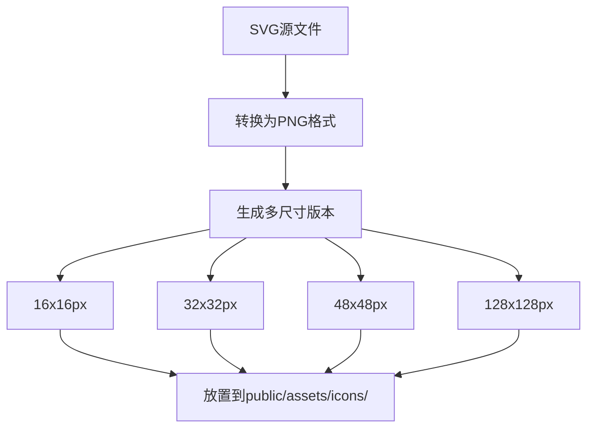
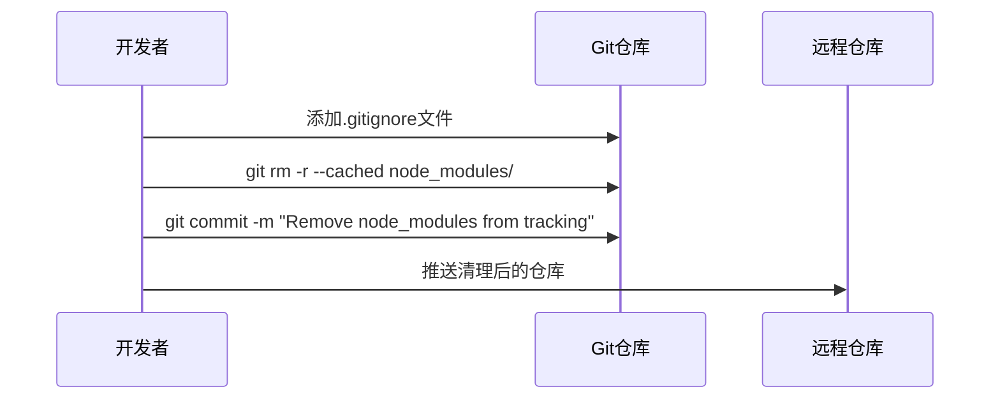
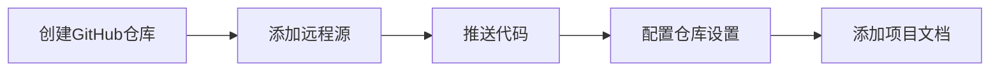

# AI Reading 项目问题修复设计文档

## 1. 项目概述

AI Reading 是一个基于 Vue 3 + TypeScript + Vite 技术栈开发的浏览器扩展项目，用于智能识别网页小说内容并提供语音朗读功能。当前项目存在三个主要问题需要解决：

1. 开发时图标文件缺失导致的构建错误
2. Git 跟踪了 node_modules 文件
3. GitHub 仓库未正确配置

## 2. 问题分析

### 2.1 图标文件缺失问题

**问题描述**：
- manifest.json 引用的图标文件（icon16.png, icon32.png, icon48.png, icon128.png）不存在
- 当前只有 SVG 格式的图标文件（icon16.svg, icon48.svg）
- @crxjs/vite-plugin 要求 manifest 中引用的资源文件必须存在

**影响范围**：
- 开发环境无法正常启动
- 插件在浏览器中可能显示默认图标
- 构建过程失败

### 2.2 Git 跟踪问题

**问题描述**：
- 项目缺少 .gitignore 文件
- node_modules 目录被 Git 跟踪
- 可能导致仓库体积过大和版本控制混乱

### 2.3 GitHub 仓库配置问题

**问题描述**：
- 本地项目尚未推送到 GitHub
- 需要创建远程仓库并建立连接

## 3. 技术方案设计

### 3.1 图标文件解决方案

#### 3.1.1 图标文件生成策略



#### 3.1.2 文件结构设计

```
public/
└── assets/
    └── icons/
        ├── icon16.png    # 16x16 像素
        ├── icon32.png    # 32x32 像素
        ├── icon48.png    # 48x48 像素
        ├── icon128.png   # 128x128 像素
        ├── icon16.svg    # 保留原有SVG
        ├── icon48.svg    # 保留原有SVG
        └── README.md     # 图标使用说明
```

#### 3.1.3 Manifest 配置验证

确保 manifest.json 中的图标路径与实际文件匹配：

| 配置项 | 路径 | 用途 |
|--------|------|------|
| action.default_icon | assets/icons/icon*.png | 工具栏图标 |
| icons | assets/icons/icon*.png | 系统显示图标 |

### 3.2 Git 配置解决方案

#### 3.2.1 .gitignore 文件设计

创建标准的前端项目 .gitignore 配置：

```
# 依赖目录
node_modules/
npm-debug.log*
yarn-debug.log*
yarn-error.log*

# 构建输出
dist/
build/

# 环境变量文件
.env
.env.local
.env.development.local
.env.test.local
.env.production.local

# IDE配置
.vscode/
.idea/
*.swp
*.swo

# 系统文件
.DS_Store
Thumbs.db

# 日志文件
*.log

# 临时文件
*.tmp
*.temp
```

#### 3.2.2 Git 清理策略



### 3.3 GitHub 仓库配置方案

#### 3.3.1 仓库初始化流程



#### 3.3.2 仓库配置要求

| 配置项 | 推荐值 | 说明 |
|--------|--------|------|
| 仓库名称 | ai-reading | 与package.json一致 |
| 描述 | 智能小说阅读浏览器插件 | 简洁明了 |
| 可见性 | Public | 开源项目 |
| 初始化 | 不添加README | 使用现有文件 |

## 4. 实施方案

### 4.1 图标文件处理

#### 4.1.1 生成PNG图标

使用以下方法将SVG转换为PNG：

1. **在线工具转换**
   - 使用 svg2png.com 或类似工具
   - 分别生成 16x16、32x32、48x48、128x128 尺寸

2. **使用设计工具**
   - Figma、Sketch 或 Canva
   - 导出为PNG格式，指定准确尺寸

3. **命令行工具**
   - 使用 ImageMagick 或 Sharp
   - 批量转换为多种尺寸

#### 4.1.2 文件放置

将生成的PNG文件放置在 `public/assets/icons/` 目录下，确保文件名与manifest.json中的引用一致。

### 4.2 Git 配置修复

#### 4.2.1 创建.gitignore

在项目根目录创建 .gitignore 文件，包含标准的前端项目忽略规则。

#### 4.2.2 清理Git跟踪

```bash
# 从Git跟踪中移除node_modules
git rm -r --cached node_modules/

# 提交更改
git add .gitignore
git commit -m "Add .gitignore and remove node_modules from tracking"
```

### 4.3 GitHub仓库设置

#### 4.3.1 创建远程仓库

在GitHub上创建新仓库，配置基本信息。

#### 4.3.2 连接本地仓库

```bash
# 添加远程源
git remote add origin https://github.com/username/ai-reading.git

# 推送代码
git branch -M main
git push -u origin main
```

## 5. 验证测试

### 5.1 开发环境测试

运行 `npm run dev` 确认：
- ✅ 构建过程无错误
- ✅ 图标正确显示
- ✅ 插件功能正常

### 5.2 Git状态验证

检查Git状态：
- ✅ node_modules 不在跟踪范围内
- ✅ .gitignore 规则生效
- ✅ 仓库大小合理

### 5.3 GitHub仓库验证

确认GitHub仓库：
- ✅ 代码成功推送
- ✅ 文件结构完整
- ✅ 项目信息准确

## 6. 后续优化建议

### 6.1 自动化图标生成

考虑添加构建脚本自动从SVG生成多尺寸PNG：

```javascript
// 在package.json中添加脚本
"scripts": {
  "generate-icons": "node scripts/generate-icons.js",
  "prebuild": "npm run generate-icons"
}
```

### 6.2 CI/CD配置

为GitHub仓库配置Actions自动化：
- 代码质量检查
- 自动化测试
- 构建验证

### 6.3 开发工作流优化

建立标准的开发流程：
- Feature分支开发
- Pull Request审查
- 版本标签管理