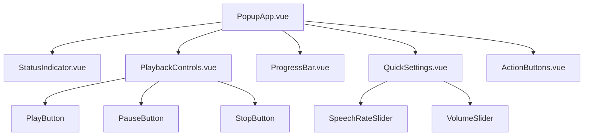
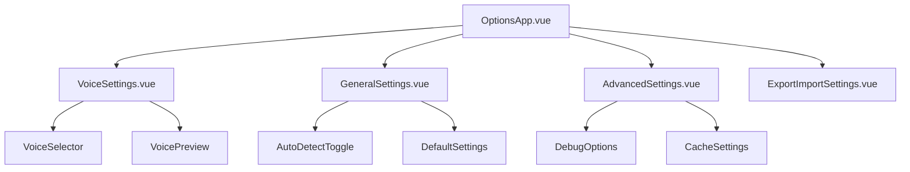
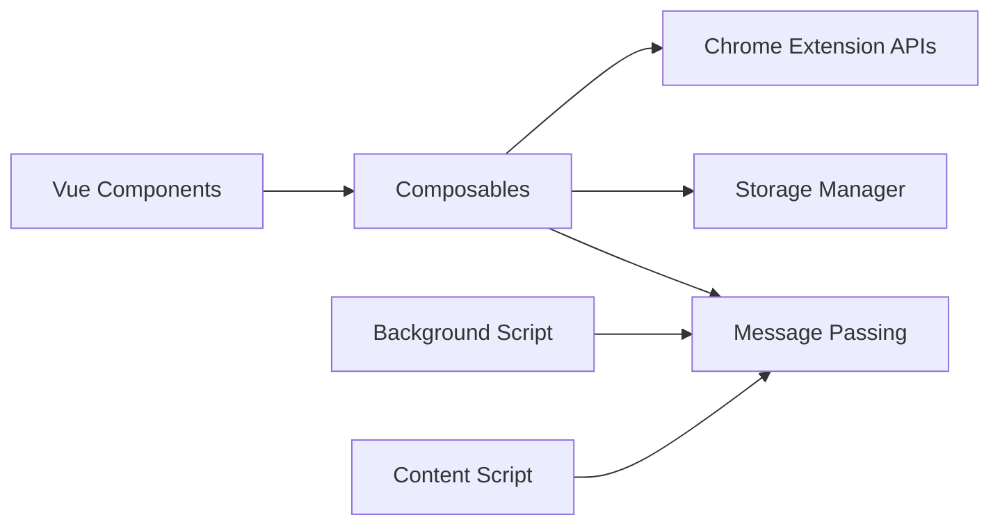

# AI Reading 浏览器插件项目重构设计方案

## 概述

本设计方案旨在将当前基于 Webpack + TypeScript + 原生 HTML/CSS 的浏览器插件项目重构为使用 Vite + Vue 3 + SCSS + TypeScript 的现代化技术栈，同时完善项目配置和文档。

### 重构目标
- 使用 Vite 替代 Webpack 作为构建工具，提升开发体验和构建性能
- 引入 Vue 3 Composition API 重构 popup 和 options 页面
- 使用 SCSS 替代原生 CSS，提供更强大的样式功能
- 完善 .gitignore 配置，避免不必要的文件提交
- 补充完整的项目文档，包括运行、开发和部署指南

## 技术栈迁移对比

| 组件 | 当前技术 | 目标技术 | 迁移原因 |
|------|----------|----------|----------|
| 构建工具 | Webpack 5 | Vite 4+ | 更快的开发服务器和 HMR |
| 前端框架 | 原生 DOM | Vue 3 | 组件化开发，更好的状态管理 |
| 样式处理 | 原生 CSS | SCSS | 变量、嵌套、混入等高级功能 |
| 类型检查 | TypeScript | TypeScript | 保持现有类型安全 |
| 测试框架 | Jest | Vitest | 与 Vite 更好集成 |

## 项目架构重构

### 新目录结构
```
ai-reading/
├── src/
│   ├── background/
│   │   └── background.ts          # Service Worker (保持不变)
│   ├── content/
│   │   ├── content.ts             # Content Script (保持不变)
│   │   ├── novel-detector.ts      # 小说检测器 (保持不变)
│   │   └── reader.ts              # 阅读器 (保持不变)
│   ├── popup/
│   │   ├── PopupApp.vue           # Vue 3 主组件
│   │   ├── components/
│   │   │   ├── StatusIndicator.vue
│   │   │   ├── PlaybackControls.vue
│   │   │   ├── ProgressBar.vue
│   │   │   └── QuickSettings.vue
│   │   ├── popup.ts               # 入口文件
│   │   └── popup.scss             # SCSS 样式
│   ├── options/
│   │   ├── OptionsApp.vue         # Vue 3 选项页面
│   │   ├── components/
│   │   │   ├── VoiceSettings.vue
│   │   │   ├── GeneralSettings.vue
│   │   │   └── AdvancedSettings.vue
│   │   ├── options.ts             # 入口文件
│   │   └── options.scss           # SCSS 样式
│   ├── utils/                     # 工具函数 (保持不变)
│   ├── styles/                    # 全局样式
│   │   ├── _variables.scss        # SCSS 变量
│   │   ├── _mixins.scss          # SCSS 混入
│   │   └── global.scss           # 全局样式
│   └── types/                     # TypeScript 类型定义
│       └── index.ts
├── public/
│   ├── manifest.json             # 插件清单文件
│   └── assets/                   # 静态资源
├── dist/                         # 构建输出
├── docs/                         # 项目文档
│   ├── development.md            # 开发指南
│   ├── deployment.md             # 部署指南
│   └── api.md                    # API 文档
├── .gitignore                    # Git 忽略文件
├── vite.config.ts                # Vite 配置
├── package.json                  # 依赖配置
├── tsconfig.json                 # TypeScript 配置
├── vitest.config.ts              # 测试配置
└── README.md                     # 项目说明
```

## Vue 组件架构设计

### Popup 页面组件结构



### Options 页面组件结构



### 状态管理架构



## 核心 Composables 设计

### useReaderController
```typescript
// 管理阅读器状态和控制逻辑
interface ReaderState {
  isReading: boolean
  progress: ProgressInfo
  settings: UserSettings
  detectionResult: DetectionResult | null
}

interface ReaderActions {
  play: () => Promise<void>
  pause: () => Promise<void>
  stop: () => Promise<void>
  updateSettings: (settings: Partial<UserSettings>) => Promise<void>
  detectContent: () => Promise<void>
}
```

### useSettings
```typescript
// 管理用户设置
interface SettingsState {
  current: UserSettings
  loading: boolean
  error: string | null
}

interface SettingsActions {
  load: () => Promise<void>
  save: (settings: Partial<UserSettings>) => Promise<void>
  reset: () => Promise<void>
  export: () => Promise<string>
  import: (data: string) => Promise<void>
}
```

### useExtensionMessaging
```typescript
// 管理插件内部通信
interface MessagingState {
  connected: boolean
  lastError: string | null
}

interface MessagingActions {
  sendToContent: <T>(message: Message) => Promise<T>
  sendToBackground: <T>(message: Message) => Promise<T>
  onMessage: (handler: MessageHandler) => void
}
```

## 构建配置重构

### Vite 配置结构
```typescript
// vite.config.ts
export default defineConfig({
  plugins: [
    vue(),
    crx({ manifest: './public/manifest.json' })
  ],
  build: {
    rollupOptions: {
      input: {
        popup: resolve(__dirname, 'src/popup/popup.html'),
        options: resolve(__dirname, 'src/options/options.html'),
        content: resolve(__dirname, 'src/content/content.ts'),
        background: resolve(__dirname, 'src/background/background.ts')
      }
    }
  }
})
```

## 依赖包管理

### 新增依赖
| 包名 | 版本 | 用途 |
|------|------|------|
| vue | ^3.3.0 | Vue 3 框架 |
| @vitejs/plugin-vue | ^4.0.0 | Vue Vite 插件 |
| vite | ^4.0.0 | 构建工具 |
| sass | ^1.60.0 | SCSS 编译器 |
| @crxjs/vite-plugin | ^2.0.0 | Chrome 扩展 Vite 插件 |
| vitest | ^0.30.0 | 测试框架 |
| @vue/test-utils | ^2.3.0 | Vue 组件测试工具 |

### 移除依赖
- webpack 相关包
- html-webpack-plugin
- copy-webpack-plugin
- css-loader
- style-loader

## 文件迁移计划

### 阶段 1：配置文件迁移
- [ ] 创建 vite.config.ts
- [ ] 更新 package.json 脚本和依赖
- [ ] 创建 vitest.config.ts
- [ ] 完善 .gitignore

### 阶段 2：样式重构
- [ ] 创建 SCSS 变量和混入文件
- [ ] 将 CSS 转换为 SCSS
- [ ] 建立响应式设计系统

### 阶段 3：Vue 组件迁移
- [ ] 创建 Popup Vue 组件
- [ ] 创建 Options Vue 组件
- [ ] 实现 Composables
- [ ] 迁移业务逻辑

### 阶段 4：测试迁移
- [ ] 迁移到 Vitest
- [ ] 添加组件测试
- [ ] 添加集成测试

### 阶段 5：文档完善
- [ ] 更新 README
- [ ] 创建开发指南
- [ ] 创建部署指南

## Git 配置完善

### .gitignore 配置
```gitignore
# 依赖
node_modules/
npm-debug.log*
yarn-debug.log*
yarn-error.log*

# 构建输出
dist/
build/
.output/

# 环境文件
.env
.env.local
.env.*.local

# IDE 文件
.vscode/
.idea/
*.swp
*.swo

# 操作系统文件
.DS_Store
Thumbs.db

# 临时文件
*.tmp
*.temp
.cache/

# 测试覆盖率
coverage/
.nyc_output/

# 日志文件
logs/
*.log

# 打包文件
*.tgz
*.tar.gz

# Chrome 扩展打包
*.crx
*.pem
web-ext-artifacts/
```

## 文档结构设计

### README.md 结构
```markdown
# AI Reading 智能阅读插件

## 快速开始
## 功能特性
## 技术栈
## 开发指南
## 构建部署
## 贡献指南
## 许可证
```

### 开发文档 (docs/development.md)
```markdown
# 开发指南

## 环境准备
## 项目结构
## 开发流程
## 调试方法
## 测试指南
## 代码规范
## 常见问题
```

### 部署文档 (docs/deployment.md)
```markdown
# 部署指南

## 构建流程
## Chrome Web Store 发布
## 版本管理
## CI/CD 配置
## 发布检查清单
```

## 迁移风险评估

### 高风险项
- Chrome Extension API 兼容性
- Vue 3 组件与扩展环境集成
- 消息传递机制保持一致性

### 中等风险项
- SCSS 编译配置
- Vite 构建输出格式
- 测试框架迁移

### 低风险项
- 依赖包更新
- 文档完善
- Git 配置优化

## 质量保证

### 代码规范
- ESLint + Prettier 配置保持
- Vue 3 官方风格指南
- TypeScript 严格模式

### 测试策略
- 单元测试：Vitest + @vue/test-utils
- 组件测试：Vue Testing Library
- 集成测试：Playwright E2E

### 性能优化
- Vue 3 Composition API 优化渲染
- Vite 构建优化和代码分割
- SCSS 模块化减少样式冗余

## 兼容性保证

### 浏览器支持
- Chrome 88+
- Edge 88+
- Firefox 扩展支持（可选）

### TypeScript 配置
- 严格模式保持
- 与 Vue 3 最佳实践对齐
- 扩展 API 类型定义

## 开发工具配置

### VS Code 推荐扩展
- Vue Language Features (Volar)
- TypeScript Vue Plugin (Volar)
- SCSS IntelliSense
- ESLint
- Prettier

### 调试配置
- Chrome 扩展开发者模式
- Vue DevTools 支持
- Source Map 配置

这个重构方案将显著提升开发体验，提供更好的代码组织结构，同时保持插件功能的完整性和稳定性。- 扩展 API 类型定义

## 开发工具配置

### VS Code 推荐扩展
- Vue Language Features (Volar)
- TypeScript Vue Plugin (Volar)
- SCSS IntelliSense
- ESLint
- Prettier

### 调试配置
- Chrome 扩展开发者模式
- Vue DevTools 支持
- Source Map 配置

这个重构方案将显著提升开发体验，提供更好的代码组织结构，同时保持插件功能的完整性和稳定性。


