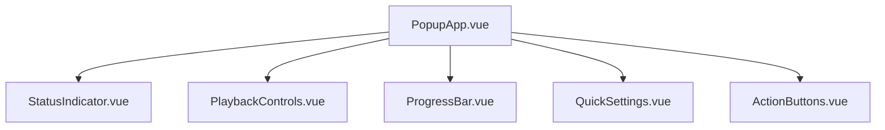

# AI Reading 智能阅读插件 v2.0

> 基于 Vue 3 + Vite + TypeScript 的现代化浏览器扩展，提供智能小说阅读和语音朗读功能。

<div align="center">
  
  
  <p>
    <a href="https://chrome.google.com/webstore"></a>
    <a href="https://github.com/qbh086/ai-reading/releases"></a>
    <a href="https://github.com/qbh086/ai-reading/blob/main/LICENSE"></a>
  </p>
</div>


## 🚀 快速开始

### 环境要求
- Node.js >= 16.0.0
- npm >= 8.0.0
- Chrome/Edge 浏览器

### 安装依赖
```bash
npm install
```

### 开发模式
```bash
# 启动开发服务器
npm run dev

# 运行测试
npm run test

# 类型检查
npm run type-check
```

### 构建生产版本
```bash
# 构建扩展
npm run build

# 代码检查
npm run lint
```

## 📁 项目结构

```
ai-reading/
├── src/
│   ├── background/          # Service Worker
│   ├── content/             # Content Scripts
│   ├── popup/               # Vue 3 弹窗组件
│   │   ├── components/      # 弹窗子组件
│   │   ├── PopupApp.vue     # 主应用组件
│   │   ├── popup.html       # HTML 入口
│   │   ├── popup.ts         # JavaScript 入口
│   │   └── popup.scss       # 样式文件
│   ├── options/             # Vue 3 设置页面
│   │   ├── components/      # 设置页面组件
│   │   └── ...
│   ├── composables/         # Vue 3 组合式API
│   │   ├── useReaderController.ts
│   │   ├── useSettings.ts
│   │   └── useExtensionMessaging.ts
│   ├── types/               # TypeScript 类型定义
│   ├── styles/              # SCSS 样式系统
│   │   ├── _variables.scss  # 变量定义
│   │   ├── _mixins.scss     # 混入函数
│   │   └── global.scss      # 全局样式
│   └── utils/               # 工具函数
├── public/                  # 静态资源
│   ├── manifest.json        # 扩展清单
│   └── assets/              # 图标等资源
├── dist/                    # 构建输出
├── docs/                    # 项目文档
├── vite.config.ts           # Vite 配置
├── vitest.config.ts         # 测试配置
└── tsconfig.json            # TypeScript 配置
```

## 🎯 核心功能

### 智能内容检测
- 自动识别小说内容
- 支持多种网站适配
- 章节结构解析

### 语音朗读
- 多语音选择
- 语速、音量调节
- 播放进度控制
- 断点续读

### 用户设置
- 个性化配置
- 设置导入导出
- 收藏语音管理

## 🧩 组件架构

### Popup 组件


### Composables 设计
- **useReaderController** - 阅读器状态管理
- **useSettings** - 用户设置管理
- **useExtensionMessaging** - 扩展内通信

## 🛠️ 开发指南

### 添加新组件
1. 在 `src/popup/components/` 或 `src/options/components/` 创建 `.vue` 文件
2. 使用 TypeScript 定义 props 和 emits
3. 应用 SCSS 样式系统
4. 编写单元测试

### 样式开发
```scss
// 使用预定义变量
.my-component {
  background: $primary-color;
  padding: $spacing-4;
  border-radius: $border-radius-md;
  
  // 使用混入
  @include button-base;
  @include flex-center;
}
```

### 类型定义
```typescript
// 在 src/types/index.ts 中定义
export interface MyComponentProps {
  title: string
  isActive: boolean
}
```

## 🧪 测试

### 运行测试
```bash
# 运行所有测试
npm run test

# 测试覆盖率
npm run test:coverage

# 测试 UI
npm run test:ui
```

### 测试结构
```
src/
├── __tests__/              # 全局测试配置
├── popup/
│   └── __tests__/          # Popup 组件测试
├── options/
│   └── __tests__/          # Options 组件测试
└── utils/
    └── __tests__/          # 工具函数测试
```

## 📦 构建部署

### Chrome 扩展安装
1. 运行 `npm run build`
2. 打开 Chrome 扩展管理页面
3. 启用开发者模式
4. 加载 `dist` 文件夹

### 发布检查清单
- [ ] 所有测试通过
- [ ] 代码质量检查通过
- [ ] 类型检查无错误
- [ ] 构建成功
- [ ] 扩展功能测试
- [ ] 更新版本号
- [ ] 更新 CHANGELOG

## 🔧 配置说明

### Vite 配置特点
- Chrome 扩展插件集成
- Vue 3 支持
- SCSS 预处理
- 类型别名配置

### ESLint + Prettier
- Vue 3 规则集成
- TypeScript 支持
- 自动格式化

## 🐛 故障排除

### 常见问题

**构建失败**
- 检查 Node.js 版本
- 清除 `node_modules` 重新安装
- 检查 TypeScript 错误

**样式不生效**
- 确认 SCSS 变量路径
- 检查 Vite 配置中的 SCSS 配置

**类型错误**
- 检查 `src/types/index.ts` 中的类型定义
- 确认组件 props 类型正确

## 🤝 贡献指南

1. Fork 项目
2. 创建功能分支 (`git checkout -b feature/AmazingFeature`)
3. 提交更改 (`git commit -m 'Add some AmazingFeature'`)
4. 推送到分支 (`git push origin feature/AmazingFeature`)
5. 打开 Pull Request

### 代码规范
- 遵循 ESLint 配置
- 使用 TypeScript 严格模式
- 编写单元测试
- 更新相关文档

## 📄 许可证

MIT License - 详见 [LICENSE](LICENSE) 文件

## 🙏 致谢

- Vue.js 团队 - 优秀的前端框架
- Vite 团队 - 快速的构建工具
- Chrome Extensions API - 强大的扩展平台

---

**开发团队** | **版本** v2.0.0 | **最后更新** 2024年12月